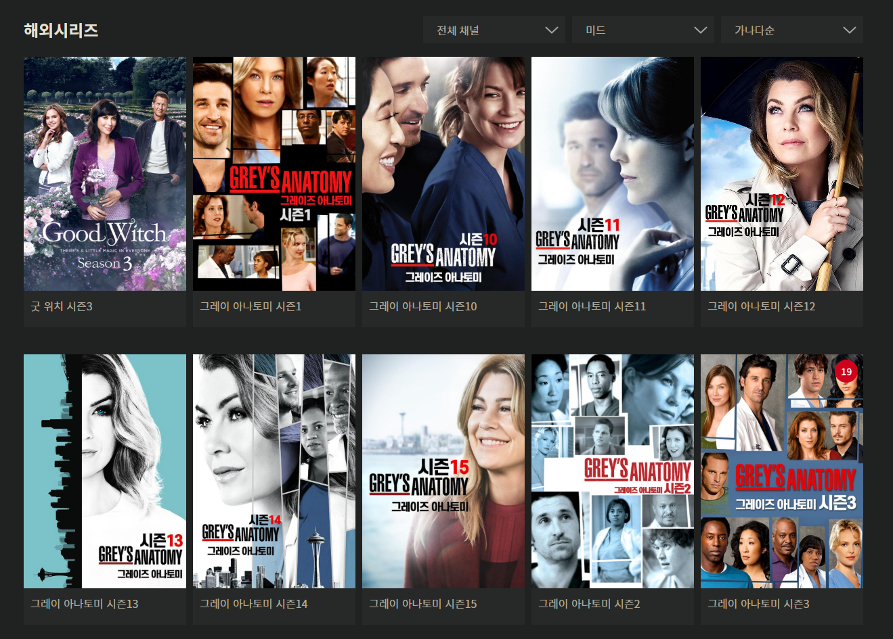

# WAVVE가 NETFLIX를 이길 수 없는 이유

 Q : 웨이브\(WAVVE\)는 넷플릭스를 이길 수 없을까요?

 대답은 이 글의 마지막에 언급하기로 하고,  
 웨이브 웹사이트 UX에서 문제가 되는 부분 몇 가지 말해보겠습니다.  
 UX 이야기를 하고 싶었던 거니까요.  
  
 웨이브는 해외 드라마를 많이 보는 사용자 입장에서 최악의 UX를 가지고 있습니다.

 첫번째는 같은 드라마지만 그룹핑이 되어 있지 않아 시즌마다 찾아봐야 한다는 겁니다.  
 영화는 제외하고, 해외 드라마의 경우 대체로 시즌제로 운영됩니다.  
 성공한 드라마는 시즌이 계속 늘어나죠.  
  
 그런데 여러 개의 시즌이 있는 컨텐츠에서 이번 시즌의 마지막 회를 보고나서  
 다음 시즌으로는 자동 재생이 되지 않습니다. 이럴 수가...  
  
 각 컨텐츠마다 시즌이 모두 분리되어 있기 때문인데요.  
 예를 들면 그레이 아나토미 시즌1을 보고 시즌2를 보기 위해 뒤로가기를 누른 후,  
 시즌2 항목을 찾아서 재생해야 하는 것이죠.  
  
 다른 서비스들과 다르게 웨이브는 왜 이런 걸까요?  
 원인으로 예상되는 부분은 두 번째 이유에서 다루겠습니다.  
  
 컨텐츠의 양이 많아 보이게끔 하기 위해 시즌별로 하나씩 분리하는 것은 전략적인 선택이지만,  
 다음 시즌을 보기 위해 뎁스를 변경해야 하다니... ㅋ

 두 번째는 정렬 기능인데요.  
 시즌별로 그룹핑이 되어 있지 않으니 다음 시즌을 찾아야 합니다.  
 어떻게 찾을까요? 상단의 검색하기를 통해서?  
 이럴 수가... 마우스만 사용해도 귀찮은데 키보드까지 사용해야 합니다.  
  
 뭐, 제목은 알고 있으니 정렬 기능을 이용하면 마우스만 가지고도 찾을 순 있겠네요.  
 그럼 정렬 기능을 사용해봅시다.  
  
 3가지 정렬 기능이 있네요.  
  
 최신순  
 인기순  
 가나다순  
  
 최신순, 인기순은 당연히 원하는 제목을 찾기 어렵겠죠? 가나다순으로 정렬합니다.  
 이런... 해외 시리즈에서 미드로 필터링을 했는데도 페이지가 17개나 되네요.  
   
 그레이 아나토미로 예를 들었으니 다시 그레이 아나토미를 찾아보겠습니다.  
 저는 지금 시즌1까지 감상했고, 시즌2를 보고 싶습니다.  
 ㄱ으로 시작하니 금방 나오네요. 2페이지에서 찾았습니다.  
 이럴 수가... 정말 말 그대로 '가나다순'으로 정렬됩니다.

 보이시나요? 무엇이 문제인지? 시즌1, 시즌10~15, 시즌2, 시즌3 이렇게 정렬됩니다.  
 결과를 보면 '그레이 아나토미 시즌1'과 '그레이 아나토미 시즌2'는 아예 다른 드라마입니다.  
 '그레이 아나토미'라는 드라마의 '시즌1', '시즌2'가 아닌거죠.  
 DB에 저장할 때부터 이미 '그레이 아나토미 시즌N'이라는 이름으로 저장한 겁니다.  
   
 이 정도면 정렬 기능을 만들어놓고 '첫 글자 가나다순으로 정렬이 잘 되네?' 하고,  
 이후에 UX 테스트를 전혀 하지 않은 수준입니다.  
 테스트를 했는데도 이 상태면 문제가 심각합니다. \(~~월급돚거 부럽다~~\)  
   
 이걸 보면 DB 설계 단계부터 시즌제 컨텐츠에 대한 고려가 전혀 되어 있지 않았음을 알 수 있습니다.  
 하지만 실무를 뛰어 보면 이런 일은 부지기수죠.  
 문제는 저렇게 시즌 정보 없이 제목만으로 정렬되는 DB 구조라면 제목을 다르게 붙였어야 합니다.  
  
 방법도 간단합니다. 윈도우에서 파일에 번호를 붙여보면 쉽게 알 수 있죠.  
 01, 02, ... , 10, 11 이렇게 붙이면 번호순대로 정렬됩니다.  
 앞에서부터 같은걸 찾기 때문인데요.  
 기술적인 내용은 저도 모르니 넘어가겠습니다.

 마지막은 추천 기능인데요.  
 다른 OTT 서비스\(라고 쓰고 넷플릭스\)를 보면 알고리즘님께서 저한테 컨텐츠를 추천해줍니다.  
 '니가 이걸 재밌게 본 것 같으니 비슷한걸 더 추천해줄테니까 이것도 보고 가렴.' 이라고 말이죠.  
  
 웨이브를 보면 실제로 이 메뉴가 있습니다.

 하지만 작동하질 않습니다.  
 메뉴는 왜 만들어 놨을까요? 나중에 업데이트 될 거니까 미리 자리를 익혀두라는 걸까요?  
  
 사실 정말 제대로 된 추천 시스템은 굉장히 복잡할 겁니다.  
 복잡하다는건 만들기 어렵다는거고 결국 돈이 많이 들어간다는거겠죠.  
  
 그런데 웃긴건 제대로 만들긴 어렵지만 대충이라도 만들긴 정말 쉽다는 겁니다.

 공유 버튼 밑의 더보기를 누르면 컨텐츠 정보가 표시되는데요.  
 장르를 보시면 태그가 붙어 있습니다.  
 미드는 엄밀히 따지면 장르라고 볼 순 없으니 메디컬 장르겠네요.  
 \(~~저는 개인적으로 메디컬 장르라고 안봅니다만... 보신 분들은 아시겠죠~~\)  
  
 심지어 저 태그를 클릭하면 메디컬 태그로 검색 결과를 보여줍니다.  
 제가 무슨 말을 하고 싶은진 아실거라 생각됩니다.

 검색 결과에 나오는 프로그램만 추천 메뉴에서 보여주면 됩니다.  
 이게 뭐 어려운 작업도 아니고 이미 있는 기능을 붙이기만 해도 그럴싸해 보일 수 있습니다.  
 어이가 없는건 영화나 한국 드라마에선 제대로 작동한다는 거에요.

 해외 드라마를 보는 사용자가 별로 없어서 제외된 걸까요?  
 만약 그렇다면 사용자가 적은 이유는 뭘까요?  
  
 넷플릭스 게섯거라를 외치지만 정작 타겟은 국산 컨텐츠 이용자인 상황.  
  
 하지만 OTT 서비스 이용자가 넷플릭스나 아마존 프라임, 왓챠 같은 서비스를 이용하는 목적이 뭘까요?  
 사람마다 다르겠지만 공중파에서 볼 수 없는 컨텐츠를 보기 위함이 아닐까 싶습니다.  
  
 공중파에서 보기 어려운 컨텐츠가 뭘까요?  
 드라마? 예능? 영화? 대부분 해외 드라마를 꼽지 않을까요?  
  
 하나의 OTT 서비스만 이용한다면 아마 대부분 넷플릭스를 이용할거라고 생각됩니다.  
 후발주자인 웨이브의 입장에서는 결국 넷플릭스의 사용자들을 데려와야 하는데,  
 넷플릭스를 보는 많은 사용자들은 해외 드라마를 보지 않을까요?  
  
 물론 제가 틀렸을 수도 있습니다.  
 애초부터 영화나 국내 드라마, 예능 다시보기를 원하는 사용자를 타겟으로 했을 수도 있죠.  
 그렇다고 이 글에서 말하는 UX의 문제점들이 사라지진 않습니다.  
  
 글의 처음에서 얘기한 질문의 대답을 해보겠습니다.  
  
 Q : 웨이브\(WAVVE\)는 넷플릭스를 이길 수 없을까요?  
 A : 네!  
  
 무엇을 만들 때 후발주자는 생각보다 정말 편합니다.  
 이미 자리잡은 아이템이든 서비스든 벤치마킹 하면 되니까요.  
 패스트 팔로어 전략이라는 것도 있지 않나요?  
  
 웨이브가 정말 제대로 성공하려는 생각이 있었다면,  
 넷플릭스의 기본적인 기능은 모두 갖고 있으면서 더 발전한 모습을 보여줬어야 합니다.  
  
 이게 후발주자의 장점이니까요.  
 그런데 후발주자의 이점을 전혀 살리지 못하고 있습니다.  
  
 개발 과정에서 어떤 일이 있었는지는 대충 예상이 됩니다만 그래서 더더욱 이길 수 없다고 봅니다.  
  
 긴 글 읽어주셔서 감사합니다.  
 행복한 하루 되세요.

